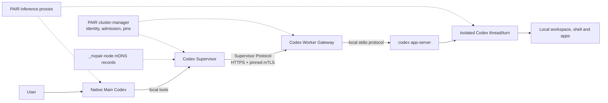

# Native Multi-Device Codex Orchestration

> **Status:** sol/max draft for parent review
> **Scope:** Architecture only; no repository changes implied.

## Decision

Build a new orchestration overlay beside PAIR:

- The user interacts with one persistent, native **Main Codex**.
- Main Codex receives local delegation tools from a deterministic **Codex Supervisor**.
- The Supervisor sends bounded tasks over a new mTLS **Supervisor Protocol** to standalone **Codex Worker Gateways** on paired computers.
- Each gateway launches a native local `codex app-server` and gives each task an isolated Codex thread and turn.
- PAIR remains the device identity, pairing, trust, discovery-hint, and inference fabric. Its scheduler, UI broker, desktop API, proxies, and inference protocol remain unchanged.

Rejected approaches are: repurposing the PAIR inference scheduler for agent tasks; relaying remote tasks through `nvpair-ui-broker`; placing agent-routing headers on inference requests; or implementing a replacement/Xamong agent runtime.

### Binding product requirements

One user-facing Main Codex; native Codex workers; multi-computer execution; Main-only delegation authority; compact context and results; PAIR-based trust; capability-aware placement; cancellation and recovery.

### Deferred speculative proposals

Cross-machine `thread/fork`, worker-to-worker messaging, task DAG execution, automatic Main failover, shared conversation memory, automatic git integration, and unrestricted artifact synchronization are not v1 requirements.

## Architecture



The Supervisor is logically authoritative for its tasks, but it is not a PAIR cluster leader. PAIR remains symmetric and peer-to-peer.

## Roles

- **Main Codex:** Maintains the user conversation, decomposes work into bounded tasks, supplies relevant context, evaluates results, and owns the final answer.
- **Codex Supervisor:** A local MCP server for Main Codex. It discovers workers, validates task envelopes, selects a worker, journals state, transports requests, and returns compact status or handoffs. It contains no model and makes no product decisions.
- **Worker Gateway:** A standalone Go service on each participating computer. It authenticates supervisors, enforces local workspace and execution policy, supervises app-server children, normalizes events, and stores task results.
- **Worker Codex:** A native Codex thread/turn running through the local app-server with that computer’s filesystem, tools, credentials, sandbox, and operating system.
- **PAIR:** Owns pairing, certificates, pins, membership, host identity, address discovery, and optional inference routing. It never carries Supervisor task payloads.
- **User:** Remains the only source of new authority for approvals that exceed established policy.

Workers cannot delegate. Any later reviewer or follow-up task is created by Main through the Supervisor.

## Supervisor Protocol

Supervisor Protocol v1 is JSON over HTTPS on a dedicated, mTLS-only worker port, default `14324`. It does not tunnel raw app-server methods.

| Operation | Purpose |
| --- | --- |
| `GET /v1/worker` | Version, authenticated identity, capabilities, capacity |
| `POST /v1/tasks` | Idempotently accept one bounded task attempt |
| `GET /v1/tasks/{id}` | Current state and latest event sequence |
| `GET /v1/tasks/{id}/events?after={seq}` | Reconnectable NDJSON event stream |
| `POST /v1/tasks/{id}/turns` | Bounded follow-up in the same worker thread |
| `POST /v1/tasks/{id}/cancel` | Idempotent cancellation |
| `POST /v1/tasks/{id}/approvals/{approvalId}` | Relay an explicit user decision |
| `GET /v1/tasks/{id}/result` | Validated handoff |
| `GET /v1/tasks/{id}/artifacts/{artifactId}` | Fetch a declared artifact |

Every mutation carries `protocolVersion`, `requestId`, `taskId`, and `attemptId` in its JSON body. The gateway persists an acceptance record before acknowledging it; replaying a `requestId` returns the original outcome.

Events have a monotonically increasing `seq`. Reconnection resumes after the last committed sequence. Only normalized state, progress, approval, artifact, and terminal events cross the network. Raw reasoning and complete app-server transcripts do not.

No agent identity or routing metadata is added to HTTP headers or inference requests.

## Worker Lifecycle

1. Gateway starts, opens PAIR’s cluster directory read-only, binds `14324`, and reports unavailable until membership and local policy are valid.
2. A task is authenticated, authorized, schema-checked, persisted, and assigned an execution slot.
3. The gateway starts one native `codex app-server` child per task attempt, performs version initialization, and creates an isolated thread.
4. It resolves a configured workspace alias to a local path, computes the effective sandbox and approval policy as the stricter intersection of the request and local policy, then starts the turn.
5. App-server events are normalized and sequence-journaled. Approval requests transition the task to `waiting_approval`.
6. On completion, the gateway validates the handoff schema, permits one bounded schema-repair turn if necessary, records artifacts, and terminates the task child after retention.

Cross-machine thread copying and `thread/fork` are excluded from v1. Follow-ups use the existing task thread through `turn/start`; after process restart the adapter uses `thread/resume` where supported.

## Discovery and mTLS Transport

The Supervisor passively browses the existing `_nvpair-node._tcp` record and parses its `hostUuid`, `clusterUuid`, canonical IP, and ranked candidate IPs. It does not register a new PAIR service or ask the UI broker for discovery.

Because mDNS is unauthenticated, a record is only a connection hint:

1. Refresh the live `clustertrust.Mesh`.
2. Reject records without a cluster principal or a current pin.
3. Try the advertised candidate addresses against fixed port `14324`.
4. Pin the server certificate byte-for-byte and present the Supervisor node’s PAIR certificate.
5. Accept capability data only after the worker verifies the client pin and delegation ACL.

The TLS certificate principal is the security identity. `hostUuid` is correlation/display metadata; duplicate or conflicting bindings are quarantined. `Mesh.Watch` provides live join/leave convergence, and pooled HTTP clients are discarded after pin or local-certificate rotation. An unclustered gateway refuses TLS handshakes rather than falling back to plaintext.

A local manual endpoint registry may supply candidate addresses when multicast is unavailable, but cannot bypass pin verification.

## Codex App-Server Integration

A versioned adapter isolates Supervisor Protocol from app-server changes. Its required semantic operations are:

- initialize and negotiate version;
- start or resume a thread;
- start a turn with `cwd`, sandbox, approval policy, and compact input;
- consume public progress, tool, approval, completion, and error events;
- submit approval decisions;
- interrupt a turn and close the process.

The exact app-server method names described in the supplied conversation are implementation assumptions, not product requirements. Unsupported versions make the worker `incompatible`; the gateway must not approximate behavior.

## Capability Selection

Workers publish authenticated, locally configured capabilities: OS/architecture, protocol and app-server versions, workspace aliases and access modes, tool labels, sandbox modes, maximum concurrency, and available slots.

Selection is deterministic:

1. Apply hard requirements: trust, protocol compatibility, workspace, OS/architecture, tools, access mode, and local security policy.
2. Honor an explicit worker selection if eligible.
3. Prefer exact workspace/tool locality, then available capacity, then least-recent assignment.
4. Break ties by authenticated cluster principal.

PAIR’s job scheduler is never queried or modified. It continues ranking inference destinations only.

## Compact Context and Handoff Contracts

Task context is capped at 256 KiB excluding separately transferred artifacts:

```json
{
  "version": 1,
  "objective": "One measurable bounded outcome",
  "relevantDecisions": ["Only facts needed for this task"],
  "workspace": {"id": "pair", "mode": "read", "baseRevision": "optional"},
  "constraints": ["No edits", "Run Windows-native tests"],
  "requiredEvidence": ["commands", "test outcomes", "file references"],
  "limits": {"wallSeconds": 1800},
  "execution": {"sandbox": "workspace-read", "approval": "relay"},
  "inputs": [{"artifactId": "a1", "sha256": "..."}]
}
```

The full Main conversation is never copied. A handoff is capped at 64 KiB:

```json
{
  "version": 1,
  "taskId": "...",
  "attemptId": "...",
  "status": "completed",
  "summary": "...",
  "findings": [{"severity": "blocker", "location": "...", "detail": "..."}],
  "changes": [],
  "verification": [{"command": "...", "outcome": "passed", "artifactId": "log1"}],
  "artifacts": [{"id": "log1", "sha256": "...", "bytes": 1234}],
  "recommendedNext": "..."
}
```

Artifacts are relative files from a per-task staging directory, addressed by ID and digest. Arbitrary remote file reads and large inline outputs are forbidden.

## Security

PAIR cluster membership authenticates a machine but does not itself authorize remote code execution. Each gateway therefore maintains a separate local allowlist of Supervisor certificate principals, workspace aliases, permitted access modes, commands/tools, resource limits, and concurrency.

Authorization is checked on every request, including reused TLS connections. Removing a pin, leaving the cluster, or removing a Supervisor ACL cancels affected active tasks and rejects new ones. The Supervisor cannot weaken worker-local policy.

Task bodies, prompts, responses, credentials, PINs, certificates, and artifact contents are never logged. Operational logs contain task/attempt IDs, principals, state, duration, and exit category only. State and staging directories use operating-system account permissions. Artifact downloads are size-limited, digest-verified, and path-contained.

## Failure and Cancellation

States are `accepted`, `starting`, `running`, `waiting_approval`, `cancelling`, `completed`, `blocked`, `failed`, `cancelled`, and `lost`.

- Network loss does not trigger reassignment. The worker continues until its deadline while journaling events.
- Reconnection reconciles by task and attempt ID; it never starts a duplicate turn.
- A worker loss after acceptance becomes `lost`. Retrying creates a new attempt and requires an explicit Main decision because the prior attempt may have produced side effects.
- App-server crashes are resumed only when the adapter can prove the thread state. Otherwise the attempt fails without replay.
- Cancellation first interrupts the turn, then terminates only that task’s app-server child after a grace period.
- Terminal results are immutable; late events from an old attempt are ignored.
- Partial, declared artifacts remain available according to retention policy.

## Exact Reuse/Change Boundary

| Reused unchanged | Newly added |
| --- | --- |
| PAIR pairing and cluster-manager | Local Supervisor MCP service |
| Cluster directory, admission, certificates, pins | Standalone Worker Gateway |
| `nodeid`, `noderec`, `clustertrust.Mesh`, pin verification, candidate IP ordering, pooled mTLS HTTP clients | Supervisor Protocol and fixed worker port |
| Existing `_nvpair-node._tcp` records as hints | Read-only discovery adapter and manual endpoint registry |
| PAIR proxies and inference routing | Capability matcher, task journals, app-server adapter, handoff/artifact schemas |

There are no changes to PAIR scheduler behavior, broker namespaces or supervision, desktop/preload contracts, inference proxy headers, existing mDNS TXT schema, or UI behavior. The UI broker is neither a local dependency nor a remote task bus.

## Phased Implementation

1. **Local vertical slice:** Worker Gateway, one app-server adapter, workspace policy, context/handoff validation, cancellation.
2. **Secure transport:** PAIR Mesh integration, mTLS endpoint, Supervisor ACL, discovery hints, multi-address dialing.
3. **Main integration:** Supervisor MCP tools, durable task/event store, deterministic capability selection, concurrent workers.
4. **Resilience and hardening:** restart reconciliation, approvals, artifact staging, limits, Windows/macOS/Linux service packaging, audit tests.

## Acceptance Tests

1. A paired, ACL-authorized Supervisor runs a task on Windows and receives a valid compact handoff.
2. Unpaired, de-pinned, wrong-certificate, plaintext, and paired-but-unauthorized clients are rejected.
3. Join, leave, certificate rotation, and pin removal take effect without restarting either service.
4. Duplicate hostnames remain distinct; candidate IP failover reaches a multihomed worker.
5. Duplicate `POST /tasks` requests create one app-server turn; event replay after disconnect has no gaps or duplicates.
6. App-server starts with the resolved local `cwd` and effective restrictive sandbox; an unsupported version accepts no task.
7. Approval-required work pauses and cannot continue from an AI-generated approval.
8. Cancellation stops only the targeted task and yields a terminal, idempotent result.
9. Worker or Supervisor restart never silently replays a side-effecting turn.
10. Main receives no full conversation, hidden reasoning, or undeclared file; logs contain no prompt or response bodies.
11. Capability tests route Windows/Xcode/tool-specific work deterministically and never call PAIR’s inference scheduler.
12. Contract snapshots prove unchanged PAIR broker methods, desktop bridge, scheduler messages, mDNS TXT schema, and inference headers.

## Unresolved Risks

- Installed app-server versions may differ in initialization, resume, cancellation, structured output, or approval semantics.
- Independent read-only mDNS browsing may not reproduce all scanner eviction behavior; successful mTLS probes must remain the availability authority.
- Fixed port `14324` can conflict with local software and has no PAIR TXT advertisement in v1.
- Workspace revisions and dirty state can differ across computers; automatic patch application remains out of scope.
- Windows service accounts may not share the interactive user’s Codex credentials, desktop session, or tool environment.
